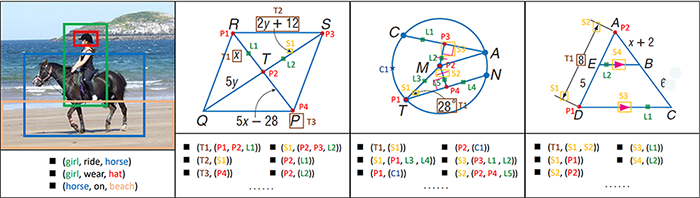

## Plane Geometry Diagram Parsing (PGDP)

The code and dataset for IJCAI 2022 Paper "[*Plane Geometry Diagram Parsing*]()".

We propose the **PGDPNet**, the first end-to-end deep learning model for explicit geometry diagram parsing. And we construct a large-scale dataset **PGDP5K**, containing dense and fine-grained annotations of primitives and relations. Our method demonstrates superior performance of diagram parsing, outperforming previous methods remarkably.
<div align=center>
	
	
</div>
<div align=center>
	Figure 1. Framework of PGDPNet
</div>
</br>
<div align=center>
	
</div>
<div align=center>
	Figure 2. Compare with SGG
</div>

## PGDP5K Dataset
You could download the dataset from:
- [[BaiduYun link](https://pan.baidu.com/s/1GWqjq-IuQNal_Veo3p4RzQ?pwd=8nht)], _keyword_: 8nht
- [[GoogleDrive link](https://drive.google.com/file/d/1KDB2EdXG3NsbkY7jAg2U2NJVJtEeMwR7/view?usp=sharing)]
#### Format of Annotation
```
"name": {
    "file_name": ...,
    "width": ...,
    "height": ...,
    "geos": {
        "points": [id, loc(x, y)], # 
        "lines": [id, loc(x1, y1, x2, y2)],
        "circles": [id, loc(x, y, r, quadrant)]           
    },
    "symbols": [id, sym_class, text_class, text_content, bbox(x, y, w, h)]
    "relations": {
        "geo2geo": [point2line(online, endpoint), point2circle(oncircle, center)],
        "sym2sym": [...],
        "sym2geo": [...]
    }
}
```
#### Format of Logic Form
```
"name": {
    "point_instances": [...],
    "line_instances": [...]
    "circle_instances": [...],
    "diagram_logic_forms": [
        PointLiesOnLine, PointLiesOnCircle, Equals, MeasureOf, Perpendicular, Parallel, LengthOf, ...
    ],
    "point_positions": {...}
}
```
## Environmental Settings
- python version: **3.8.3**
- CUDA version: **10.1**
- gcc version: **5.4.0**
- Other settings refer to *requirements.txt*
```
pip install -r requirements.txt
conda install pytorch==1.7.1 torchvision==0.8.2 torchaudio==0.7.2 cudatoolkit=10.1 -c pytorch
conda install -c dglteam dgl-cuda10.1
```

We use **4 NVIDIA 1080ti GPUs** for the training and more GPUs with large batch size will bring a little performance improvment.


## Usage

Decompress three json files of train/val/test datasets in the fold of **./dataset/AiProducts**, more details please see the config files in the fold of **./configs**.

```bash
# Get dataset of AiProducts
sh ./dataset/get_dataset_AiProducts.sh
```

```bash
# Training the model and the models will be saved in the fold of ./log/AiProducts 
python main.py  
```

```bash
# Finetune the model
python main.py --RESUME_MODEL ./log/AiProducts/best_model.pth --DATASET_TRAIN_JSON ./dataset/AiProducts/converted_val.json 
```
 
```bash
# Test the model
python test.py --RESUME_MODEL ./log/AiProducts/best_model.pth
```

```bash
# Adjust the classifier using the tau-norm method and the models will be saved in the fold of ./log_tau
python tau_norm.py --RESUME_MODEL ./log/AiProducts/best_model.pth
```

More experiments need to be tried such as different *image size*, *backbone*, *optimizer* or *learning rate decay method* which noly need change the config file.

## Data format

The annotation of a dataset is a dict consisting of two field: `annotations` and `num_classes`.
The field `annotations` is a list of dict with `fpath` and `category_id`.

Here is an example.
```
AiProducts
{
    'annotations': 
	[
        {
		"category_id": 0, 
		"fpath": "/val/00000/1849756.jpg"
        },
        ...
    ]
    'num_classes': 50030
}
```
## Demo


## Citation

If the paper, the dataset, or the code helps you, please cite the paper in the following format:
```
@inproceedings{,
  title = {Plane Geometry Diagram Parsing},
  author = {},
  booktitle = {},
  year = {2022}
}
```


## Acknowledge
The codes of this project are based on [FCOS](https://github.com/tianzhi0549/FCOS/) and [Inter-GPS](https://github.com/lupantech/InterGPS). Please let us know if you encounter any issues. You could contact with the first author (zhangmingliang2018@ia.ac.cn) or leave an issue in the github repo.
