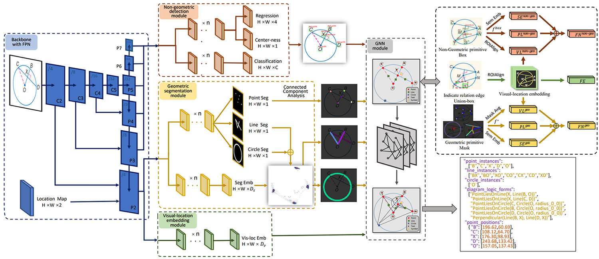
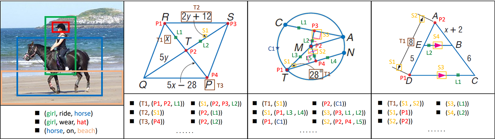
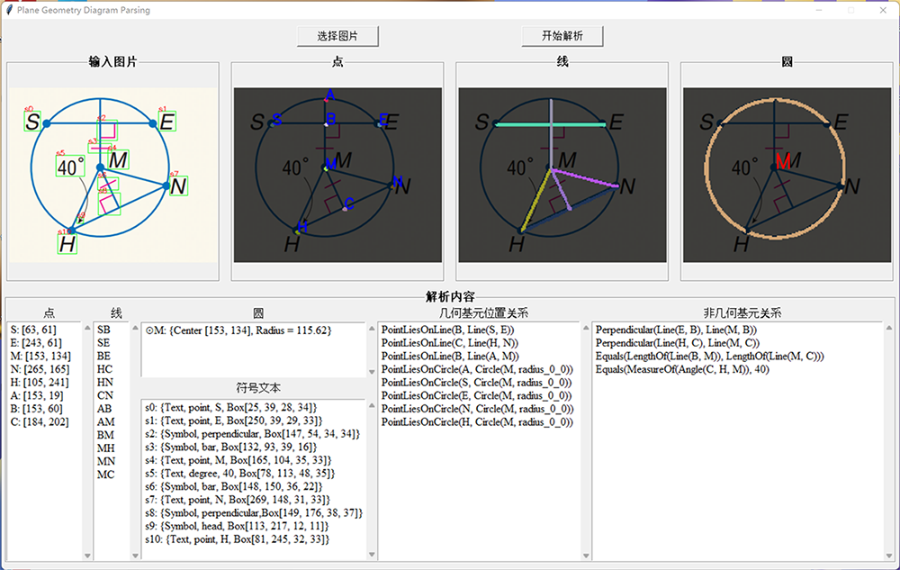

## Plane Geometry Diagram Parsing (PGDP)

The code and dataset for IJCAI 2022 paper "[*Plane Geometry Diagram Parsing*](https://arxiv.org/pdf/2205.09363.pdf)".

We propose the **PGDPNet**, the first end-to-end deep learning model for explicit geometry diagram parsing. And we construct a large-scale dataset **PGDP5K**, containing dense and fine-grained annotations of primitives and relations. Our method demonstrates superior performance of diagram parsing, outperforming previous methods remarkably.
<div align=center>
	
	
</div>
<div align=center>
	Figure 1. Framework of PGDPNet
</div>
</br>
<div align=center>
	
</div>
<div align=center>
	Figure 2. Compare with SGG
</div>

## Updates

- Complete submission of the initial model (21/4/2022)

## PGDP5K Dataset
You could download the dataset from [Dataset Homepage](http://www.nlpr.ia.ac.cn/databases/CASIA-PGDP5K/index.html).

#### Format of Annotation
```
"name": {
    "file_name": ...,
    "width": ...,
    "height": ...,
    "geos": {
        "points": [id, loc(x, y)], 
        "lines": [id, loc(x1, y1, x2, y2)],
        "circles": [id, loc(x, y, r, quadrant)]           
    },
    "symbols": [id, sym_class, text_class, text_content, bbox(x, y, w, h)],
    "relations": {
        "geo2geo": [point2line(online, endpoint), point2circle(oncircle, center)],
        "sym2sym": [...],
        "sym2geo": [...]
    }
}
```
#### Format of Logic Form
```
"name": {
    "point_instances": [...],
    "line_instances": [...],
    "circle_instances": [...],
    "diagram_logic_forms": [
        PointLiesOnLine, PointLiesOnCircle, Equals, MeasureOf, Perpendicular, 
        Parallel, LengthOf, ...
    ],
    "point_positions": {...}
}
```
## Environmental Settings
- Python version: **3.8**
- CUDA version: **10.1**
- GCC version: **5.4.0**
- Other settings refer to *requirements.txt*
```
conda install pytorch==1.7.1 torchvision==0.8.2 torchaudio==0.7.2 cudatoolkit=10.1 -c pytorch
conda install -c dglteam dgl-cuda10.1==0.6.1
pip install -r requirements.txt
```

We use **4 NVIDIA TITAN Xp GPUs** for the training and more GPUs with large batch size will bring some performance improvment.

## Installation

The following will install the lib with symbolic links, so that you can modify the files if you want and won't need to re-build it.
```
python setup.py build develop --no-deps
```

## Training

At first, you should set the paths of dataset in the `./geo_parse/config/paths_catalog.py`. Change the varibles of `DATA_DIR`, `PGDP5K_train`, `PGDP5K_val` and `PGDP_test` according to the location of PGDP5K dataset. The default parameter configurations are set in the config files of `./configs/PGDP5K/geo_MNV2_FPN.yaml` and `./geo_parse/config/defaults.py`, and you could adjust them according to your situations.

```
python -m torch.distributed.launch \
    --nproc_per_node=4 \
    --master_port=$((RANDOM + 10000)) \
    tools/train_net.py \
    --config-file configs/PGDP5K/geo_MNV2_FPN.yaml \
    SOLVER.IMS_PER_BATCH 12 \
    TEST.IMS_PER_BATCH 4 \
    OUTPUT_DIR training_dir/PGDP5K_geo_MNV2_FPN
```
The training records of the PGDPNet are saved in the folder `OUTPUT_DIR`, including models, log, last checkpoint and inference results.  

## Inference

Set the path of model weight and corresponding config file to get inference results, and the parsing results are saved in the new folder `.\inference` by default.

```
python tools/test_net.py \
    --config-file configs/PGDP5K/geo_MNV2_FPN.yaml \
    MODEL.WEIGHT training_dir/PGDP5K_geo_MNV2_FPN/model_final.pth \
    TEST.IMS_PER_BATCH 1
```
The inference process use one GPU with batch size 1 in default. Due to effect of image resolution in the preprocessing, it has some difference ammong experimental results with various batch sizes. And you could reduce image resolutions appropriatly to accelerate inference while maintaining comparable performance.

## Logic Form Evaluation

Considering the diversity and equality of logic forms, we improved the evaluation method based on [Inter-GPS](https://github.com/lupantech/InterGPS). You can evaluate the generated logic forms compared with the ground truth by setting paths of test set (`test_set_path`), ground truth of logic form (`diagram_gt`) and predication of logic form (`diagram_pred`):

```
cd ./InterGPS/diagram_parser/evaluation_new
```
```
python calc_diagram_accuracy.py \ 
    --test_set_path ./PGDP5K/test \ 
    --diagram_gt ./PGDP5K/our_diagram_logic_forms_annot.json \ 
    --diagram_pred ./inference/PGDP5K_test/logic_forms_pred.json
```

<div align=center>
	Table 1. Evaluation Results of Logic Form
</div>
</br>
<table align="center">
	<tr>
        <td colspan="2"></td>
	    <td align="center"><b>InterGPS</b></td>
	    <td align="center"><b>PGDPNet<br>w/o GNN</b></td>
	    <td align="center"><b>PGDPNet</b></td>  
	</tr>
    <tr>
        <td rowspan="4"><b>All</b></td>
        <td><b>Likely Same</b></td>
	    <td align="center">65.7</td>
	    <td align="center">98.4</td>
	    <td align="center">99.0</td>  
	</tr>
    <tr>
        <td><b>Almost Same</b></td>
	    <td align="center">44.4</td>
	    <td align="center">93.1</td>
	    <td align="center">96.6</td>  
	</tr>
    <tr>
        <td><b>Perfect Recall</b></td>
	    <td align="center">40.0</td>
	    <td align="center">79.7</td>
	    <td align="center">86.2</td>  
	</tr>
    <tr>
        <td><b>Totally Same</b></td>
	    <td align="center"><b>27.3</b></td>
	    <td align="center"><b>78.2<font color='red'> (+50.9) </font></b></td>
	    <td align="center"><b>84.7<font color='red'> (+6.5) </font></b></td>  
	</tr>
      <tr>
        <td rowspan="4"><b>Geo2Geo</b></td>
        <td><b>Likely Same</b></td>
        <td align="center">63.9</td>
	    <td align="center">99.1</td>
	    <td align="center">99.0</td>
	</tr>
    <tr>
        <td><b>Almost Same</b></td>
        <td align="center">49.4</td>
	    <td align="center">97.3</td>
	    <td align="center">97.1</td>   
	</tr>
    <tr>
        <td><b>Perfect Recall</b></td>
	    <td align="center">78.7</td>
	    <td align="center">96.9</td>
	    <td align="center">97.4</td>  
	</tr>
    <tr>
        <td><b>Totally Same</b></td>
	    <td align="center">40.8</td>
	    <td align="center">93.6</td>
	    <td align="center">94.5</td>  
	</tr>
      <tr>
        <td rowspan="4"><b>Non-Geo2Geo</b></td>
        <td><b>Likely Same</b></td>
	    <td align="center">67.3</td>
	    <td align="center">95.8</td>
	    <td align="center">98.0</td>  
	</tr>
    <tr>
        <td><b>Almost Same</b></td>
	    <td align="center">49.8</td>
	    <td align="center">88.2</td>
	    <td align="center">94.9</td>  
	</tr>
    <tr>
        <td><b>Perfect Recall</b></td>
	    <td align="center">45.7</td>
	    <td align="center">81.3</td>
	    <td align="center">87.0</td>  
	</tr>
    <tr>
        <td><b>Totally Same</b></td>
	    <td align="center">40.5</td>
	    <td align="center">80.6</td>
	    <td align="center">86.4</td>  
	</tr>
</table>

## Demo
We also realize the demo script in the `demo/PGDP_Demo.ipynb`. Because this project has not implemented a text recognizer, only samples from the PGDP5K can be tested at this time whose text contents are set as ground truth. During use, you could adjust corresponding variables in the demo script, such as `config-file`, `weights`, `MODEL.DEVICE` and `img_path`.
<div align=center>
	
</div>
<div align=center>
	Figure 3. Demo of Parsing Output
</div>

## Citation

If the paper, the dataset, or the code helps you, please cite the papers in the following format:
```
@inproceedings{Zhang2023PGPS,
  title     = {A Multi-Modal Neural Geometric Solver with Textual Clauses Parsed from Diagram},
  author    = {Zhang, Ming-Liang and Yin, Fei and Liu, Cheng-Lin},
  booktitle = {IJCAI},
  year      = {2023},
}

@inproceedings{Zhang2022,
  title     = {Plane Geometry Diagram Parsing},
  author    = {Zhang, Ming-Liang and Yin, Fei and Hao, Yi-Han and Liu, Cheng-Lin},
  booktitle = {Proceedings of the Thirty-First International Joint Conference on
               Artificial Intelligence, {IJCAI-22}},
  pages     = {1636--1643},
  year      = {2022},
  month     = {7},
  doi       = {10.24963/ijcai.2022/228},
}

@article{Hao2022PGDP5KAD,
  title={PGDP5K: A Diagram Parsing Dataset for Plane Geometry Problems},
  author={Yihan Hao and Mingliang Zhang and Fei Yin and Linlin Huang},
  journal={2022 26th International Conference on Pattern Recognition (ICPR)},
  year={2022},
  pages={1763-1769}
}
```


## Acknowledge
The codes of this project are based on [FCOS](https://github.com/tianzhi0549/FCOS/) and [Inter-GPS](https://github.com/lupantech/InterGPS). Please let us know if you encounter any issues. You could contact with the first author or leave an issue in the github repo.
