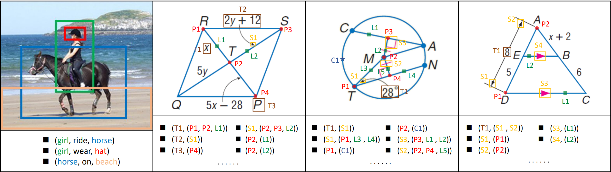

## Plane Geometry Diagram Parsing

The code and dataset for IJCAI 2022 Paper "Plane Geometry Diagram Parsing" [PDF].

We propose the **PGDPNet**, the first end-to-end deep learning model for explicit geometry diagram parsing. And we construct a large-scale dataset **PGDP5K**, containing dense and fine-grained annotations of primitives and relations. Our method demonstrates superior performance of diagram parsing, outperforming previous methods remarkably




## PGDP5K dataset

You could download the dataset from:
- [BaiduYun link](https://pan.baidu.com/s/1RVArHmqmaA-P7ba53ue75Q), _keyword_: a5sj
- [GoogleDrive link](https://drive.google.com/file/d/1UnGJO70Tth8u_PAu3UiHixevw-_UfxrP/view?usp=sharing)

## Environmental settings
This repository is developed using python **3.5.2** on Ubuntu **16.04.5 LTS**. The CUDA and CUDNN version is **9.0** and **7.1.3** respectively. For AiProducts experiments, we use **four NVIDIA 1080ti GPU cards** for training and testing. Other platforms or GPU cards are not fully tested.

## Pretrain models

We provide the pretrain backbone of [resnet50](https://download.pytorch.org/models/resnet50-19c8e357.pth) or [resnet101](https://download.pytorch.org/models/resnet101-5d3b4d8f.pth) trained on ImageNet , which will put in the fold of **./pretrain_models**.
And we also provide the best model of resnest50 [BaiduYun link](https://pan.baidu.com/s/1stfwhTeEALCofVFIKqGmvw), keyword: g2xy, [GoogleDrive link](https://drive.google.com/file/d/1VwzrvMU7M5gux5ZPyZPgMK4PizT3z7qi/view?usp=sharing)


## Usage

Decompress three json files of train/val/test datasets in the fold of **./dataset/AiProducts**, more details please see the config files in the fold of **./configs**.

```bash
# Get dataset of AiProducts
sh ./dataset/get_dataset_AiProducts.sh
```

```bash
# Training the model and the models will be saved in the fold of ./log/AiProducts 
python main.py  
```

```bash
# Finetune the model
python main.py --RESUME_MODEL ./log/AiProducts/best_model.pth --DATASET_TRAIN_JSON ./dataset/AiProducts/converted_val.json 
```
 
```bash
# Test the model
python test.py --RESUME_MODEL ./log/AiProducts/best_model.pth
```

```bash
# Adjust the classifier using the tau-norm method and the models will be saved in the fold of ./log_tau
python tau_norm.py --RESUME_MODEL ./log/AiProducts/best_model.pth
```

More experiments need to be tried such as different *image size*, *backbone*, *optimizer* or *learning rate decay method* which noly need change the config file.

## Data format

The annotation of a dataset is a dict consisting of two field: `annotations` and `num_classes`.
The field `annotations` is a list of dict with `fpath` and `category_id`.

Here is an example.
```
AiProducts
{
    'annotations': 
	[
        {
		"category_id": 0, 
		"fpath": "/val/00000/1849756.jpg"
        },
        ...
    ]
    'num_classes': 50030
}
```
## Acknowledge

Thanks for the help of my partners Baole Wei, Yirong Yang. Please let me know if you encounter any issues(my email zhangmingliang2018@ia.ac.cn).
